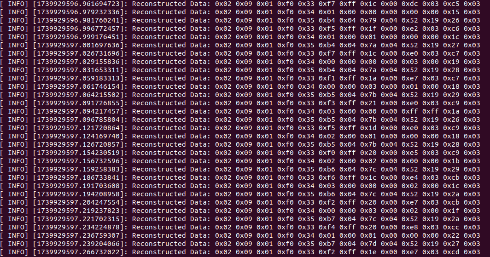
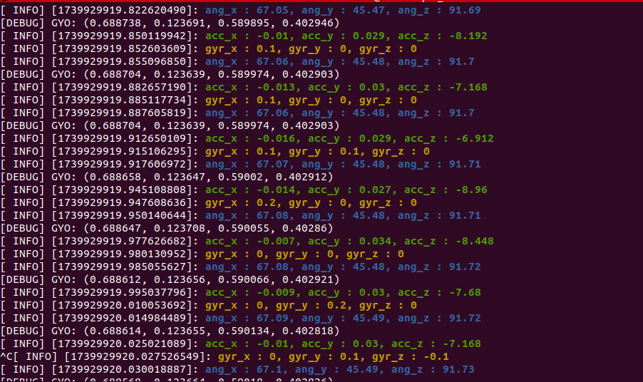

1. MW-AHRS-x1 IMU 센서  ROS1 드라이버 개발
2. Serial 통신기반 ros loop rate 1000hz이상까지 퍼블리쉬 테스트 완료 (멀티스레딩 최적화)
3. 115200, 921600 baudrate 정상 작동 완료

# IMU X1 드라이버 설정 가이드

이 문서는 **IMU AHRS X1 9축 센서**를 **ROS 환경에서 설정 및 실행**하는 방법을 설명합니다.

---

## 📌 1. USB 장치 정보 확인

먼저, 연결된 USB 장치 정보를 확인합니다.

```bash
udevadm info -a -n /dev/ttyUSB0
```

### ✅ 출력 예시
```bash
  ATTRS{idVendor}=="1d6b"
  ATTRS{idProduct}=="0002"
  ATTRS{serial}=="12345678"
```

---

## 📌 2. udev 규칙 설정 (심볼릭 링크 생성)

### (1) udev 파일 생성 및 수정
```bash
sudo nano /etc/udev/rules.d/99-usb-serial_x1.rules
```

#### ✅ 예제 내용 (`99-usb-serial_x1.rules`)
```udev
KERNEL=="ttyUSB*", ATTRS{idVendor}=="1d6b", ATTRS{idProduct}=="0002", SYMLINK+="serial_x1"
```
- `SYMLINK+="serial_x1"` → `/dev/serial_x1` 심볼릭 링크 생성
- `KERNEL=="ttyUSB*"` 대신 `SUBSYSTEM=="tty"`로 변경 가능 (사용 환경에 따라 조정)
- `ATTRS{idVendor}=="1d6b"` 대신 `ATTRS{serial}=="12345678"`로 변경 가능

### (2) udev 규칙 적용
```bash
sudo udevadm control --reload-rules
sudo udevadm trigger
```

### (3) 설정 적용 확인
```bash
ls -l /dev/serial_x1
```
출력 예시:
```bash
crw-rw-rw- 1 root dialout 188, 0 Feb 18 12:34 /dev/serial_x1
```

---

## 📌 3. ROS 패키지 빌드

### (1) ROS 워크스페이스에서 `catkin_make` 실행
```bash
cd ~/ws
catkin_make
```

---

## 📌 4. ROS 환경 설정

`serial_x1.launch` 파일을 설정합니다.

```xml
<launch>
  <arg name="serial_port" default="/dev/serial_x1" />  <!-- udev 규칙 적용 후 변경 -->
  <arg name="baud_rate" default="115200" />
  <arg name="rate_hz" default="400" />   
  <arg name="frame_id" default="imu_link" />

  <node pkg="serial_x1" type="imu_x1_node" name="imu_x1_node" output="screen">
    <param name="serial_port" type="string" value="$(arg serial_port)" />
    <param name="baud_rate" type="int" value="$(arg baud_rate)" />
    <param name="rate_hz" type="int" value="$(arg rate_hz)" />
    <param name="frame_id" type="string" value="$(arg frame_id)" />
  </node>
</launch>
```

---

## 📌 5. 환경 변수 적용

```bash
source ~/ws/devel/setup.bash
```

---

## 📌 6. 드라이버 실행

```bash
roslaunch serial_x1 serial_x1.launch
```

---

## 🛠️ 문제 해결

1. **`/dev/serial_x1`가 생성되지 않는 경우**
   - `udevadm info -a -n /dev/ttyUSB0` 실행 후 `idVendor`, `idProduct` 값 확인
   - `sudo udevadm control --reload-rules && sudo udevadm trigger` 실행 후 다시 확인

2. **권한 문제 발생 (`Permission denied`)**
   ```bash
   sudo chmod 666 /dev/serial_x1
   ```

3. **드라이버 노드 실행 시 오류 발생**
   - `dmesg | grep ttyUSB`를 통해 USB 장치 인식 여부 확인
   - `ls -l /dev/serial_x1` 명령어로 심볼릭 링크 확인

---

### 📌 참고
- ROS 패키지 구조: `~/ws/src/serial_x1`
- 설정 파일 위치: `~/ws/src/serial_x1/launch/serial_x1.launch`


## 드라이버 내부 패킷 수신 화면


## RAW 데이터 출력 화면



# IMU Quaternion 설명

IMU에서 출력하는 `imu.orientation.w, x, y, z` 값은 **Z-Y-X (yaw-pitch-roll) 순서의 회전을 반영한 quaternion 값**입니다.  
아래 표는 각 요소의 의미를 정리한 것입니다.

| 요소 | 의미 | 관련된 회전축 | 설명 |
|------|------|--------------|------|
| `imu.orientation.w` | 스칼라 값 | - | 전체 회전 변환의 정도를 나타냄. 1에 가까울수록 회전이 적음. |
| `imu.orientation.x` | X축 회전 성분 | X축 (1, 0, 0) | Roll (구르기, 좌우 기울기)에 대한 기여도. |
| `imu.orientation.y` | Y축 회전 성분 | Y축 (0, 1, 0) | Pitch (앞뒤 기울기)에 대한 기여도. |
| `imu.orientation.z` | Z축 회전 성분 | Z축 (0, 0, 1) | Yaw (좌우 방향 회전)에 대한 기여도. |

## Quaternion 계산 공식

다음 수식은 Z-Y-X 회전 순서에 따라 오일러 각을 quaternion으로 변환하는 공식입니다.

\[
w = \cos(z) \cos(y) \cos(x) + \sin(z) \sin(y) \sin(x)
\]

\[
x = \cos(z) \cos(y) \sin(x) - \sin(z) \sin(y) \cos(x)
\]

\[
y = \cos(z) \sin(y) \cos(x) + \sin(z) \cos(y) \sin(x)
\]

\[
z = \sin(z) \cos(y) \cos(x) - \cos(z) \sin(y) \sin(x)
\]

여기서:
- `x = ang_x (roll)` : X축을 기준으로 회전
- `y = ang_y (pitch)` : Y축을 기준으로 회전
- `z = ang_z (yaw)` : Z축을 기준으로 회전

## SW에서 2바퀴 회전하는 원인 및 해결 방법

| 원인 | 설명 | 해결 방법 |
|------|------|----------|
| 오일러 각 범위 초과 | ±180°를 넘어가면 값이 갑자기 반대 방향으로 튀는 문제 발생 | 각도를 ±180° 범위로 제한 |
| Quaternion 변환 오류 | 오일러 각 → quaternion 변환 과정에서 ±180°를 넘어갈 때 불연속적 변환이 발생 | quaternion 정규화 적용 |
| 센서 wrap-around 문제 | IMU 센서가 360°를 넘으면 0°로 초기화되면서 갑자기 반대 방향으로 바뀜 | 오일러 각 변환 시 연속성을 유지하는 보정 적용 |

### ✅ **오일러 각 범위 제한 코드**
```cpp
if (ang_x > 180.0) ang_x -= 360.0;
if (ang_x < -180.0) ang_x += 360.0;
if (ang_y > 180.0) ang_y -= 360.0;
if (ang_y < -180.0) ang_y += 360.0;
if (ang_z > 180.0) ang_z -= 360.0;
if (ang_z < -180.0) ang_z += 360.0;
